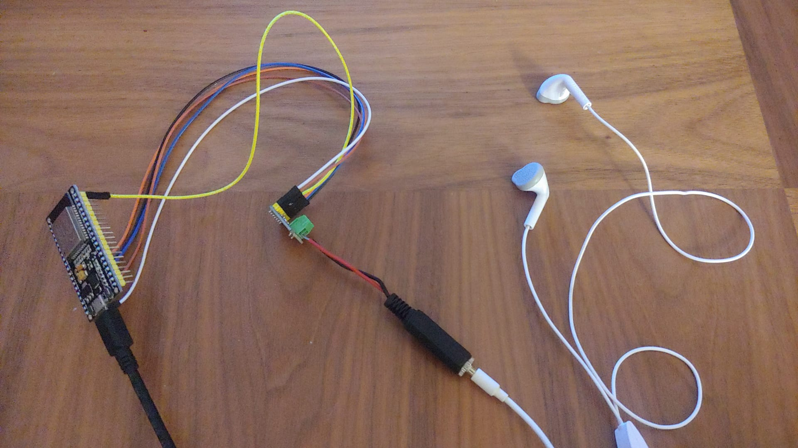
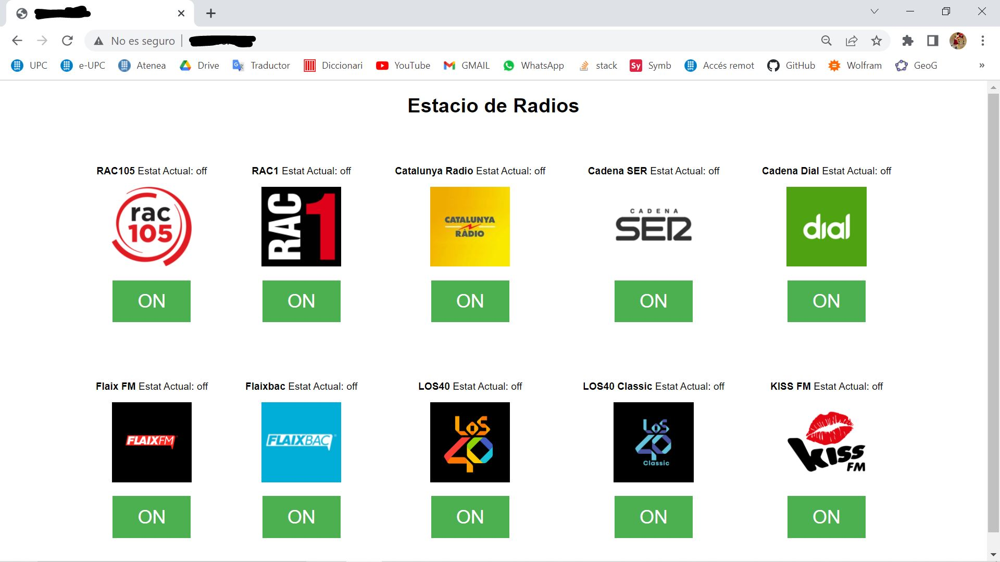
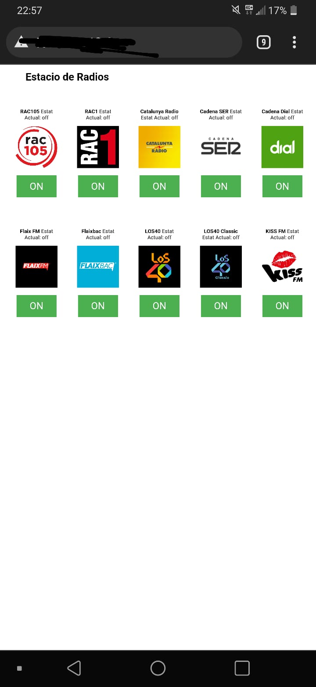

# Projecte : Web d'Emisores de Radio

## **Objectiu** 
La finalitat d'aquest projecte és aconseguir crear un servidor web on es pugui triar entre deu de les radios més escoltades a nivell local i estatal:

- **RAC105**: Música Éxits (CAT)
- **RAC1** : Notícies i Podcasts (CAT) 
- **Catalunya Radio** : Notícies i Podcasts (CAT)
- **Cadena SER** : Notícies i Podcasts (ESP)
- **Cadena Dial** : Música Espanyola (ESP)
- **Flaix FM** : Música Electro/Urban (CAT)
- **Flaixbac** : Música Éxits (CAT)
- **LOS40** : Música Pop/Rock/Urban (ESP)
- **LOS40 Classic** : Música 80's (ESP)
- **KISS FM** : Música 80's (ESP) 

Aixó s'aconseguirà fent servir les llibreries "WiFi.h", "Audio.h" i "WebServer.h". Més endavant, a l'apartat *Explicació i Funcionament del Codi* s'explica en detall les funcions usades de cada llibreria.

## **Material**

### Tecnologies Utilitzades
- ESP32-WROOM-32
- MAX98357 I2S
- Adaptador d'entrada JACK
- Cable d'àudio JACK
- Altaveu
- Cables femella-famella

### Software
- Visual studio
- PlatformIO

## **PART 1: Memòria Interna**

## **Codi**
~~~cpp
// Load Wi-Fi library
#include <WiFi.h> //W
#include "Arduino.h" //A
#include "WiFi.h" //A
#include "Audio.h" //A
#include <WebServer.h> //A

#define I2S_DOUT     25 //A
 
#define I2S_BCLK      27 //A

#define I2S_LRC        26 //A

Audio audio; //A

// Replace with your network credentials
const char* ssid = "g7ThinQ"; //AW
const char* password = "gere7777"; //AW

void handle_root(void); //A

// Set web server port number to 80
WiFiServer server(80); //AW

// Variable to store the HTTP request
String header; //W

// Auxiliar variables to store the current output state
String radio1 = "off"; //W
String radio2 = "off"; //W
String radio3 = "off"; //W
String radio4 = "off"; //W
String radio5 = "off"; //W
String radio6 = "off"; //W
String radio7 = "off"; //W
String radio8 = "off"; //W
String radio9 = "off"; //W
String radio10 = "off"; //W

String nomRadio1 = "RAC105";
String nomRadio2 = "RAC1";
String nomRadio3 = "Catalunya Radio";
String nomRadio4 = "Cadena SER";
String nomRadio5 = "Cadena Dial";
String nomRadio6 = "Flaix FM";
String nomRadio7 = "Flaixbac";
String nomRadio8 = "LOS40";
String nomRadio9 = "LOS40 Classic";
String nomRadio10 = "KISS FM";

const char urlRadio1 [49] = "https://25633.live.streamtheworld.com/RAC105.mp3";
const char urlRadio2 [48] = "https://22183.live.streamtheworld.com/RAC_1.mp3";
const char urlRadio3 [53] = "https://shoutcast.ccma.cat/ccma/catalunyaradioHD.mp3";
const char urlRadio4 [51] = "http://25553.live.streamtheworld.com/CADENASER.mp3";
const char urlRadio5 [52] = "http://25653.live.streamtheworld.com/CADENADIAL.mp3";
const char urlRadio6 [57] = "http://nodo07-cloud01.streaming-pro.com:8000/flaixfm.mp3";
const char urlRadio7 [59] = "https://nodo02-cloud01.streaming-pro.com:8005/flaixbac.mp3";
const char urlRadio8 [47] = "http://21633.live.streamtheworld.com/LOS40.mp3";
const char urlRadio9 [55] = "http://25553.live.streamtheworld.com/LOS40_CLASSIC.mp3";
const char urlRadio10 [49] = "http://kissfm.kissfmradio.cires21.com/kissfm.mp3";

// Current time
unsigned long currentTime = millis(); //W
// Previous time
unsigned long previousTime = 0;  //W
// Define timeout time in milliseconds (example: 2000ms = 2s)
const long timeoutTime = 2000; //W

void setup() {
  Serial.begin(115200); //AW

  // Connect to Wi-Fi network with SSID and password
  Serial.print("Connecting to "); //AW
  Serial.println(ssid); //AW
  
  WiFi.disconnect();  //A

  WiFi.mode(WIFI_STA);  //A
  
  WiFi.begin(ssid, password); //AW

  while (WiFi.status() != WL_CONNECTED) {  //AW
    delay(500);
    Serial.print(".");
  }
  // Print local IP address and start web server
  Serial.println(""); //AW
  Serial.println("WiFi connected."); //AW
  Serial.println("IP address: "); //AW
  Serial.println(WiFi.localIP()); //AW
  server.begin(); //AW

  audio.setPinout(I2S_BCLK, I2S_LRC, I2S_DOUT); //A
  audio.setVolume(100); //A
}

void loop(){
  
  
  audio.loop();
  

    radio1 = "off";
    radio2 = "off";
    radio3 = "off";
    radio4 = "off";
    radio5 = "off";
    radio6 = "off";
    radio7 = "off";
    radio8 = "off";
    radio9 = "off";
    radio10 = "off";
  
  if (radio1 == "on"){
    radio2 = "off";
    radio3 = "off";
    radio4 = "off";
    radio5 = "off";
    radio6 = "off";
    radio7 = "off";
    radio8 = "off";
    radio9 = "off";
    radio10 = "off";
  }

  else if (radio2 == "on"){
    radio1 = "off";
    radio3 = "off";
    radio4 = "off";
    radio5 = "off";
    radio6 = "off";
    radio7 = "off";
    radio8 = "off";
    radio9 = "off";
    radio10 = "off";
  }

  else if (radio3 == "on"){
    radio1 = "off";
    radio2 = "off";
    radio4 = "off";
    radio5 = "off";
    radio6 = "off";
    radio7 = "off";
    radio8 = "off";
    radio9 = "off";
    radio10 = "off";
  }

  else if (radio4 == "on"){
    radio1 = "off";
    radio3 = "off";
    radio2 = "off";
    radio5 = "off";
    radio6 = "off";
    radio7 = "off";
    radio8 = "off";
    radio9 = "off";
    radio10 = "off";
  }

  else if (radio5 == "on"){
    radio1 = "off";
    radio3 = "off";
    radio4 = "off";
    radio2 = "off";
    radio6 = "off";
    radio7 = "off";
    radio8 = "off";
    radio9 = "off";
    radio10 = "off";
  }

  else if (radio6 == "on"){
    radio1 = "off";
    radio3 = "off";
    radio4 = "off";
    radio5 = "off";
    radio2 = "off";
    radio7 = "off";
    radio8 = "off";
    radio9 = "off";
    radio10 = "off";
  }

  else if (radio7 == "on"){
    radio1 = "off";
    radio3 = "off";
    radio4 = "off";
    radio5 = "off";
    radio6 = "off";
    radio2 = "off";
    radio8 = "off";
    radio9 = "off";
    radio10 = "off";
  }

  else if (radio8 == "on"){
    radio1 = "off";
    radio3 = "off";
    radio4 = "off";
    radio5 = "off";
    radio6 = "off";
    radio7 = "off";
    radio2 = "off";
    radio9 = "off";
    radio10 = "off";
  }

  else if (radio9 == "on"){
    radio1 = "off";
    radio3 = "off";
    radio4 = "off";
    radio5 = "off";
    radio6 = "off";
    radio7 = "off";
    radio8 = "off";
    radio2 = "off";
    radio10 = "off";
  }

  else if (radio10 == "on"){
    radio1 = "off";
    radio3 = "off";
    radio4 = "off";
    radio5 = "off";
    radio6 = "off";
    radio7 = "off";
    radio8 = "off";
    radio9 = "off";
    radio2 = "off";
  }

  WiFiClient client = server.available();   // Listen for incoming clients

  if (client) {                             // If a new client connects,
    currentTime = millis();
    previousTime = currentTime;
    Serial.println("New Client.");          // print a message out in the serial port
    String currentLine = "";                // make a String to hold incoming data from the client
    while (client.connected() && currentTime - previousTime <= timeoutTime) {  // loop while the client's connected
      currentTime = millis();
      if (client.available()) {             // if there's bytes to read from the client,
        char c = client.read();             // read a byte, then
        Serial.write(c);                    // print it out the serial monitor
        header += c;
        if (c == '\n') {                    // if the byte is a newline character
          // if the current line is blank, you got two newline characters in a row.
          // that's the end of the client HTTP request, so send a response:
          if (currentLine.length() == 0) {
            // HTTP headers always start with a response code (e.g. HTTP/1.1 200 OK)
            // and a content-type so the client knows what's coming, then a blank line:
            client.println("HTTP/1.1 200 OK");
            client.println("Content-type:text/html");
            client.println("Connection: close");
            client.println();
            
            // Activa el link de la radio
            if (header.indexOf("GET /radio1/on") >= 0) {
              Serial.println(nomRadio1 + " ON");
              radio1 = "on";
              audio.connecttohost(urlRadio1); 
            } else if (header.indexOf("GET /radio1/off") >= 0) {
              Serial.println(nomRadio1 + " OFF");
              radio1 = "off";
              audio.stopSong();
            
            } else if (header.indexOf("GET /radio2/on") >= 0) {
              Serial.println(nomRadio2 + " ON");
              radio2 = "on";
              audio.connecttohost(urlRadio2);
            } else if (header.indexOf("GET /radio2/off") >= 0) {
              Serial.println(nomRadio2 + " OFF");
              radio2 = "off";
              audio.stopSong();
            }
              else if (header.indexOf("GET /radio3/on") >= 0) {
              Serial.println(nomRadio3 + " ON");
              radio3 = "on";
              audio.connecttohost(urlRadio3);
            } else if (header.indexOf("GET /radio3/off") >= 0) {
              Serial.println(nomRadio3 + " OFF");
              radio3 = "off";
              audio.stopSong();
            
            } else if (header.indexOf("GET /radio4/on") >= 0) {
              Serial.println(nomRadio4 + " ON");
              radio4 = "on";
              audio.connecttohost(urlRadio4);
            } else if (header.indexOf("GET /radio4/off") >= 0) {
              Serial.println(nomRadio4 + " OFF");
              radio4 = "off";
              audio.stopSong();
            }
              else if (header.indexOf("GET /radio5/on") >= 0) {
              Serial.println(nomRadio5 + " ON");
              radio5 = "on";
              audio.connecttohost(urlRadio5); 
            } else if (header.indexOf("GET /radio5/off") >= 0) {
              Serial.println(nomRadio5 + " OFF");
              radio5 = "off";
              audio.stopSong();
            
            } else if (header.indexOf("GET /radio6/on") >= 0) {
              Serial.println(nomRadio6 + " ON");
              radio6 = "on";
              audio.connecttohost(urlRadio6);
            } else if (header.indexOf("GET /radio6/off") >= 0) {
              Serial.println(nomRadio6 + " OFF");
              radio6 = "off";
              audio.stopSong();
            }
              else if (header.indexOf("GET /radio7/on") >= 0) {
              Serial.println(nomRadio7 + " ON");
              radio7 = "on";
              audio.connecttohost(urlRadio7);
            } else if (header.indexOf("GET /radio7/off") >= 0) {
              Serial.println(nomRadio7 + " OFF");
              radio7 = "off";
              audio.stopSong();
            
            } else if (header.indexOf("GET /radio8/on") >= 0) {
              Serial.println(nomRadio8 + " ON");
              radio8 = "on";
              audio.connecttohost(urlRadio8);
            } else if (header.indexOf("GET /radio8/off") >= 0) {
              Serial.println(nomRadio8 + " OFF");
              radio8 = "off";
              audio.stopSong();
            }
              else if (header.indexOf("GET /radio9/on") >= 0) {
              Serial.println(nomRadio9 + " ON");
              radio9 = "on";
              audio.connecttohost(urlRadio9); 
            } else if (header.indexOf("GET /radio9/off") >= 0) {
              Serial.println(nomRadio9 + " OFF");
              radio9 = "off";
              audio.stopSong();
            
            } else if (header.indexOf("GET /radio10/on") >= 0) {
              Serial.println(nomRadio10 + " ON");
              radio10 = "on";
              audio.connecttohost(urlRadio10);
            } else if (header.indexOf("GET /radio10/off") >= 0) {
              Serial.println(nomRadio10 + " OFF");
              radio10 = "off";
              audio.stopSong();
            }
            
            // Display the HTML web page
            client.println("<!DOCTYPE html><html>");
            client.println("<head><meta name=\"viewport\" content=\"width=device-width, initial-scale=1\">");
            client.println("<link rel=\"icon\" href=\"data:,\">");
            // CSS to style the on/off buttons 
            // Feel free to change the background-color and font-size attributes to fit your preferences
            client.println("</head>");
                        
            // Web Page Heading
            client.println("<body><h1>Emisores de Radio</h1>");
            
            // Display current state, and ON/OFF buttons for GPIO 26  
            
            client.println("
 <TABLE CELLPADDING=20 CELLSPACING=20> <TR> <TD>");
            
            client.println("
 
 <strong>" + nomRadio1 + "</strong> Estat Actual: " + radio1 + "
 
");
            client.println("
 <input type='image' src='https://www.rac105.cat/assets/uploads/2017/11/logo-rac105.png' width='128' height='128'/> 
");

            // If the output26State is off, it displays the ON button       
            if (radio1=="off") {
              client.println("
 
<a href=\"/radio1/on\"><button class=\"button\">ON</button></a>
 
");
            } else {
              client.println("
 
<a href=\"/radio1/off\"><button class=\"button button2\">OFF</button></a>
 
");
            } 
             
            // Display current state, and ON/OFF buttons for GPIO 27  
            client.println("</TD> <TD> 
 
 <strong>" + nomRadio2 + "</strong> Estat Actual: " + radio2 + "
 
");
            client.println("
 <input type='image' src='https://upload.wikimedia.org/wikipedia/commons/f/fd/Logotip_de_RAC_1.jpg' width='128' height='128' /> 
");
            // If the output27State is off, it displays the ON button       
            if (radio2=="off") {
              client.println("

<a href=\"/radio2/on\"><button class=\"button\">ON</button></a>

");
            } else {
              client.println("

<a href=\"/radio2/off\"><button class=\"button button2\">OFF</button></a>

");
            }
            
            // Display current state, and ON/OFF buttons for GPIO 26  
            client.println("</TD> <TD> 
 
 <strong>" + nomRadio3 + "</strong> Estat Actual: " + radio3 + "

");
            client.println("
<input type='image' src='https://enacast.com/media/cache/51/d5/51d5e463dc4d31bc8391bdbd8a148a59.jpg' />
");
            // If the output26State is off, it displays the ON button       
            if (radio3=="off") {
              client.println("

<a href=\"/radio3/on\"><button class=\"button\">ON</button></a>

");
            } else {
              client.println("

<a href=\"/radio3/off\"><button class=\"button button2\">OFF</button></a>

");
            } 
             
            // Display current state, and ON/OFF buttons for GPIO 27  
            client.println("</TD> <TD> 
 
 <strong>" + nomRadio4 + "</strong> Estat Actual: " + radio4 + "

");
            client.println("
<input type='image' src='http://images.radio.orange.com/radios/medium_cadena_ser.png' />
");
            // If the output27State is off, it displays the ON button       
            if (radio4=="off") {
              client.println("

<a href=\"/radio4/on\"><button class=\"button\">ON</button></a>

");
            } else {
              client.println("

<a href=\"/radio4/off\"><button class=\"button button2\">OFF</button></a>

");
            }
            // Display current state, and ON/OFF buttons for GPIO 26  
            client.println("</TD> <TD> 
 
 <strong>" + nomRadio5 + "</strong> Estat Actual: " + radio5 + "

");
            client.println("
<input type='image' src='data:image/png;base64,iVBORw0KGgoAAAANSUhEUgAAAIAAAACACAMAAAD04JH5AAAAdVBMVEVPoxL////8/vtKoAtDnQLt9uf5/Pdjri1qsTZaqSGm0Yc9mgC/3ajo8+BOoxFHnweGwFy12Jzd7dGfzX7y+O6s04+SxmzM5Lp2t0ao0oq02JrE4K/Y68twtD+by3jJ47Z9u1Db7M6Nw2bT6MScy3rp9OKAvVR4BRhOAAADdElEQVR4nO2Y25abIBSGOakhKnjMwUSTic28/yMWEQXjtJ0s6epF93+RrOgf+NjAZitCIBAIBAKBQCAQCAQCgUAgEAgEel+UMfGe3W//bLev37FHZcOpv+4pygkO+HdDIGgd4jDyCIB6/A4AvSi7TwBWqwa/D8DKwe4RgEYhxt8HEDwY7B4B2GEY0bcBWKbtPgGa9wDKfw2w9w6QA8D/CiAopWINIOjKRZ1fvgAkozzaRZwyugCgjEfWRbVrp1xSd89QxL0ASNnW14qQMOjPbexsQxblVYrMXFC5O/cBwaT6aE5UIsnrNNzFHgDYqcdWyQ1PqZhlKiunk2t3IdbV3+P2iTHxAKBOU9WAaZvMfQQcyftw3QDILrS3h688VV8eAAS6Od1alEBVGMXwYwSQ+ZcuDwD0Zhojg2wPATfHjAaQzcpF/ACYRTyNCDtTMNYFeFiE5oRcuzYDyHZqK8gf2SGv5rYVQDJFgEaV6TfID8oVWJLNANME1JwN4jn+AoBNE9AYV+MrAnJnhnKIx81O43IFwCkfA4A74xJx5wlgXAEE17G9NHbrArDH6Mpt8W+y1fYIHPW/K+fgMSXhAmBMzpXTxxSUjQACPfXSStznGgM1Azw5vQ4pB9+k42IXfXMjwLi6Ce5cALP7LABCqXbtF67SD0Comz4smt6vAJ5fYHZeAPgYgXLRdPMKIArtqheusw8AYYJ7dGdXzfjLIpS9XgO969LXPOyCaSnZtuVplQfMqsCt42o95YFu3OFHOe1DIa5rgM/xUk/n3Sp7PwBTkse5HEfHxGWdiseZUkro6JI08ZQJpxWnJvgkVJIX98LWA85Z8MO4rnc0uE5Xb/XAHAKMi6RJCjzLjYBAM9eLy0M98Fie9GuAng4rc3l/XQ+kf+7qVwR7Ww86Fd8EYBKg4rQlkeMyAC/Z/D3J/XL8izVAdG2oCcjKRWwESCv/1M9vYpAF2BS8+iPNhhnXACpTZ2ZorC0WruAxHFr6uUC5uk2v6Rg/B/PQniWKo6uJAK6yuWWJutSukJrH/KYjoHJy2G0Y/yDBeNb0RVEc60+VChAV2e3I2fmj5NJ1oXt9/CiKvsk4o+pJ6Z5co7grztH215QqCahkKCQzHTKdGtUT49Kl7lOhPs1rVH1fUObtyRwEAoFAIBAIBAKBQCAQCAQCgUB/ST8BA7EvZSIMqe0AAAAASUVORK5CYII='/> 
 ");
            // If the output26State is off, it displays the ON button       
            if (radio5=="off") {
              client.println("

<a href=\"/radio5/on\"><button class=\"button\">ON</button></a>

");
            } else {
              client.println("

<a href=\"/radio5/off\"><button class=\"button button2\">OFF</button></a>

");
            } 
             
            // Display current state, and ON/OFF buttons for GPIO 27  
            client.println("</TD> </TR> <TR> <TD>

 <strong>" + nomRadio6 + "</strong> Estat Actual: " + radio6 + "

");
            client.println("
<input type='image' src='https://www.radio.es/images/broadcasts/e4/64/4228/1/c300.png' width='128' height='128' />
");
            // If the output27State is off, it displays the ON button       
            if (radio6=="off") {
              client.println("

<a href=\"/radio6/on\"><button class=\"button\">ON</button></a>

");
            } else {
              client.println("

<a href=\"/radio6/off\"><button class=\"button button2\">OFF</button></a>

");
            }
            
            // Display current state, and ON/OFF buttons for GPIO 26  
            client.println("</TD> <TD> 
 
 <strong>" + nomRadio7 + "</strong> Estat Actual: " + radio7 + "

");
            client.println("
<input type='image' src='https://yt3.ggpht.com/ytc/AKedOLRoXrdC_lTEEdaBFwsIlJA3iwkGmvCDJjUjMSyw9A=s900-c-k-c0x00ffffff-no-rj' width='128' height='128' />
");
            // If the output26State is off, it displays the ON button       
            if (radio7=="off") {
              client.println("

<a href=\"/radio7/on\"><button class=\"button\">ON</button></a>

");
            } else {
              client.println("

<a href=\"/radio7/off\"><button class=\"button button2\">OFF</button></a>

");
            } 
             
            // Display current state, and ON/OFF buttons for GPIO 27  
            client.println("</TD> <TD> 
 
 <strong>" + nomRadio8 + "</strong> Estat Actual: " + radio8 + "
 
");
            client.println("
<input type='image' src='https://d3kle7qwymxpcy.cloudfront.net/images/broadcasts/4c/ce/10732/1/c175.png' width='128' height='128' />
");
            // If the output27State is off, it displays the ON button       
            if (radio8=="off") {
              client.println("

<a href=\"/radio8/on\"><button class=\"button\">ON</button></a>

");
            } else {
              client.println("

<a href=\"/radio8/off\"><button class=\"button button2\">OFF</button></a>

");
            }
            // Display current state, and ON/OFF buttons for GPIO 26  
            client.println("</TD> <TD> 
 
 <strong>" + nomRadio9 + "</strong> Estat Actual: " + radio9 + "

");
            client.println("
<input type='image' src='https://static.mytuner.mobi/media/tvos_radios/WwgbG6g5tt.png' width='128' height='128' />
");
            // If the output26State is off, it displays the ON button       
            if (radio9=="off") {
              client.println("

<a href=\"/radio9/on\"><button class=\"button\">ON</button></a>

");
            } else {
              client.println("

<a href=\"/radio9/off\"><button class=\"button button2\">OFF</button></a>

");
            } 
             
            // Display current state, and ON/OFF buttons for GPIO 27  
            client.println("</TD> <TD> 
 
 <strong>" + nomRadio10 + "</strong> Estat Actual: " + radio10 + "

");
            client.println("
<input type='image' src='https://www.radio.es/images/broadcasts/8b/a9/118558/1/c300.png' width='128' height='128' />
");
            // If the output27State is off, it displays the ON button       
            if (radio10=="off") {
              client.println("

<a href=\"/radio10/on\"><button class=\"button\">ON</button></a>

 </TD> </TR> </TABLE>");
            } else {
              client.println("

<a href=\"/radio10/off\"><button class=\"button button2\">OFF</button></a>

 </TD> </TR> </TABLE> 
");
            }
            
            client.println("</body></html>");
            
            // The HTTP response ends with another blank line
            client.println();
            // Break out of the while loop
            break;
          } else { // if you got a newline, then clear currentLine
            currentLine = "";
          }
        } else if (c != '\r') {  // if you got anything else but a carriage return character,
          currentLine += c;      // add it to the end of the currentLine
        }
      }
    }
    
    // Clear the header variable
    header = "";
    // Close the connection
    client.stop();
    Serial.println("Client disconnected.");
    Serial.println("");
    
  }

    
}
~~~

## **Explicació i Funcionament del Codi**
Primerament s'inclouen les llibreries esmentades a la introducció i es defineixen els pins del MAX98357. A part es crea una variable d'audiò anomenada "audio" i s'escpecifica el nom de la connexió WiFi i la seva contrasenya corresponent. 

Seguidament, s'arrancarà el servidor amb la funció *handle_root()*, es definirà el seu número de port i la variable *header* que contindrà les instruccions HTTP.

A continuació, es declaren les dades de les deu radios: el seu estat (On/Off), el seu nom i la direcció web de l'arxiu .mp3 que reprodueix la radio en directe. 

Després d'això es declaren tres variables: *currentTime*, *previousTime* i *timeoutTime*. Aquestes variables s'utilitzaran més endavant per definir els temps de cada "client".

Ja a dins del setup, es connecta el WiFi i es mostra el missatge de confirmació i la direcció IP pel *terminal*. Finalment es defineixen els pins a la funció *audio.setPinout()* i s'especifica el nivell del volum de l'àudio a *audio.setVolume()*.

Seguidament s'obra un *loop()*. La primera funció *audio.loop()* s'encarregarà de reproduïr l'àudio indefinidament.     
A continuació trobem una série de *if*s que serviran per no deixar que dues radios estiguin obertes simultàniament i, seguidament, es declara la variable *client*. Quan un client es connecti s'entrarà dintre del *if*. Quan el client, un cop dins del servidor, premi el botó d'ON o OFF a una radio es mostrarà pel *terminal* el nom de la radio i el seu estat, per exemple *Flaixbac ON*. En el cas de premer el botó ON, es cridarà a la funció *audio.connecttohost(urlRadio)*, que es connectarà a l'URL declarat anteriorment. En canvi, si es prem el botó OFF, s'apagarà la senyal d'àudio fent servir la funció *audio.stopSong()*.  
Tot seguit, es troba tot el codi HTML de la pàgina Web, on estan definits els botons d'ON i OFF, l'icona de cada radio i el format de la pàgina, entre altres.  
Finalment s'esborra el contingut de la variable *header* i es desconnecta al client amb la funció *client.stop()*.

En aspectes de connexions físiques, mitjançant cables famella-famella, es connecta el microprocessador al I2S. Al I2S se li connecta un adaptador d'entrada JACK on es pot connectar qualsevol dispositiu d'àudio JACK.

## **Muntatge**

## **Resultat al server (PC)**
   

## **Resultat al server (Mòbil)**

