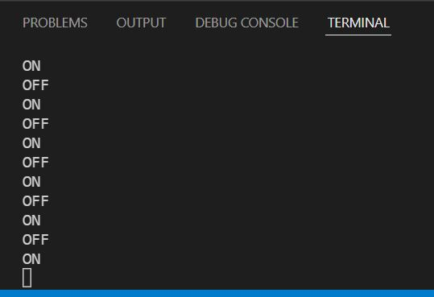
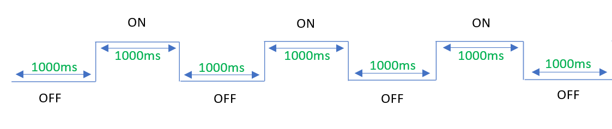
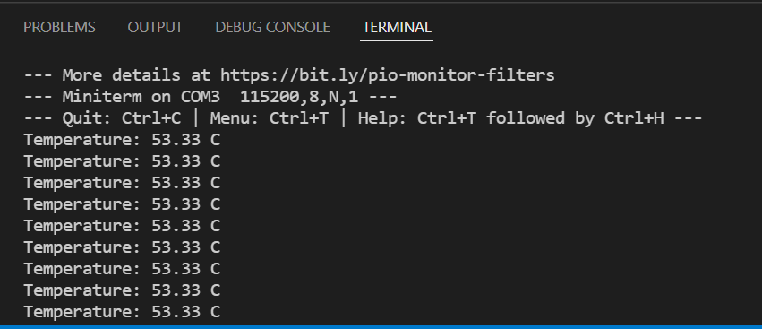

# Pràctica 1 : Blink

## **Objectiu** 
L'objectiu principal de la pràctica és produir el parpelleig periòdic d'un led.

## **Material**

### Tecnologies Utilitzades
- ESP32-WROOM-32
### Software
- Visual studio
- PlatformIO

## **Codi**
~~~cpp
#include <Arduino.h>

void setup() {
// initialize the digital pin.

    pinMode(1, OUTPUT);
    Serial.begin(115200);
}

// the loop routine runs forever:
void loop() {
    // LED ON (HIGH is the voltage level)
    digitalWrite(1, HIGH); 
    delay(1000); // wait for a second
    Serial.println("OFF");
    // LED OFF by making the voltage LOW
    digitalWrite(1, LOW);
    delay(1000); // wait for a second
    Serial.println("ON");
}
~~~

## **Explicació i Funcionament del Codi**
Primerament es defineix quin serà el pin de sortida del microprossessador que farem servir. En aquest cas faré servir un LED del propi ESP32. En aquesta placa, el LED està associat al pin número 1.

Un cop definit el pin de sortida, s'ha d'especificar la velocitat del monitor, aquesta ha de coincidir amb la descrita a l'arxiu "platformio.ini". En aquesta pràctica s'utilitzarà una velocitat de 115200.    

Finalment, trobem un bucle (loop) infinit, que compleix la funció d'encendre el LED i apagar-lo, amb un temps de retard (delay) de 1000ms. A part indicarà si està obert (on) o apagat (off) amb un missatge al "terminal" del PlatformIO.

## **Resultat al "Terminal"**

## **Diagrama de Fluxe** 

## **Diagrama de Temps** 

## **Temps Lliure del Procesador?** 
Com es pot observar al diagrama de temps anterior, el processador té un temps lliure de 1000ms, que és el temps que transcorre (delay) entre les accions d'encendre i apagar el LED.

## **Exercici Voluntari**
Llegir el valor del sensor de temperatura intern i mostrar-lo al "terminal":

#### **Codi**
~~~cpp
#include <Arduino.h>

#ifdef __cplusplus
extern "C" {
#endif
uint8_t temprature_sens_read();
#ifdef __cplusplus
}
#endif
uint8_t temprature_sens_read();

void setup() {
  Serial.begin(115200);
}

void loop() {
  Serial.print("Temperature: ");
  
  // Convert raw temperature in F to Celsius degrees
  Serial.print((temprature_sens_read() - 32) / 1.8);
  Serial.println(" C");
  delay(5000);
}
~~~
#### **Resultat al "Terminal"**
