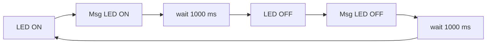

# Pràctica 1 : Blink

## **Objectiu** 
L'objectiu principal de la pràctica és produir el parpelleig periòdic d'un led.

## **Material**

### Tecnologies utilitzades
- ESP32-WROOM-32
### Software
- Visual studio
- PlatformIO

## **Codi**
~~~
#include <Arduino.h>

void setup() {
// initialize the digital pin as an output.

pinMode(1, OUTPUT);
Serial.begin(115200);
}

// the loop routine runs over and over again forever:
void loop() {
digitalWrite(1, HIGH); // turn the LED on (HIGH is the voltage level)
delay(1000); // wait for a second
Serial.println("OFF");
digitalWrite(1, LOW); // turn the LED off by making the voltage LOW
delay(1000); // wait for a second
Serial.println("ON");
}
~~~

## **Explicació i funcionament del codi**
Primerament es defineix quin serà el pin de sortida del microprossessador que farem servir. En aquest cas faré servir un LED del propi ESP32. En aquesta placa, el LED està associat al pin número 1.

Un cop definit el pin de sortida, s'ha d'especificar la velocitat del monitor, aquesta ha de coincidir amb la descrita a l'arxiu "platformio.ini". En aquesta pràctica s'utilitzarà una velocitat de 115200.    

Finalment, trobem un bucle (loop) infinit, que compleix la funció d'encendre el LED i apagar-lo, amb un temps de retard (delay) de 1000ms. A part indicarà si està obert (on) o apagat (off) amb un missatge al "terminal" del PlatformIO.

Resultat al "Terminal": 

### **Diagrama de fluxe** 

## **Respuestas y conclusiones** 
### **Diagrama de tiempos** 

Como se ve en el gráfico de tiempo se puede observar que cada 500ms el led cambia de estar encendido a apagado hasta que paramos el programa.

El procesador no para hasta que el programa se para de forma manual puesto a que el programa es un loop es decir una instrucción de iteración infinita.

## **Referencias**
<https://randomnerdtutorials.com/esp32-pinout-reference-gpios/>

<https://github.com/schacon/blink>