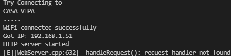
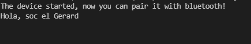
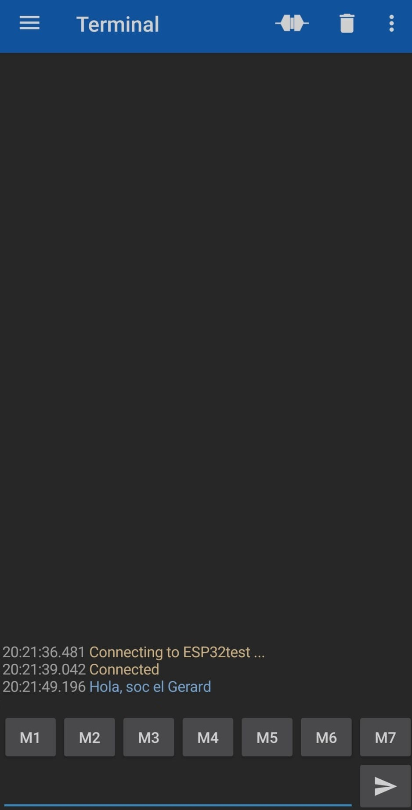

# Pràctica 3 : WIFI i BLUETOOTH

## **Objectiu** 
L'objectiu principal de la pràctica és entendre el funcionament del wifi i bluetooth. Per aconseguir-ho generarem una pàgina web des del microprocessador i una comunicació sèrie amb una aplicació de mòbil mitjançant bluetooth.

Per tant la pràctica es separarà en dues parts, una per la pàgina web i l'altra pel bluetooth.

## **Material**

### Tecnologies Utilitzades
- ESP32-WROOM-32
### Software
- Visual studio
- PlatformIO

## **PART 1: Pàgina Web**

## **Codi**
~~~cpp
#include <WiFi.h>
#include <WebServer.h>
#include <Arduino.h>

// SSID & Password
const char* ssid = "g7ThinQ"; // Enter your SSID here
const char* password = "gere7777"; //Enter your Password here

void handle_root(void);

WebServer server(80); // Object of WebServer(HTTP port, 80 is defult)

void setup() {
  Serial.begin(115200);
  Serial.println("Try Connecting to ");
  Serial.println(ssid);
// Connect to your wi-fi modem
  WiFi.begin(ssid, password);
// Check wi-fi is connected to wi-fi network
  while (WiFi.status() != WL_CONNECTED) {
    delay(1000);
    Serial.print(".");
  }
  Serial.println("");
  Serial.println("WiFi connected successfully");
  Serial.print("Got IP: ");
  Serial.println(WiFi.localIP()); //Show ESP32 IP on serial
  server.on("/", handle_root);
  server.begin();
  Serial.println("HTTP server started");
  delay(100);
}

void loop() {
  server.handleClient();
}
// HTML & CSS contents which display on web server
String HTML = "<!DOCTYPE html>\
<html>\
<body>\
<h1> Soc el Gerard &#128522 i aquesta es la meva primera pagina web amb ESP32;</h1>\
</body>\
</html>";
// Handle root url (/)
void handle_root() {
  server.send(200, "text/html", HTML);
}
~~~

## **Explicació i Funcionament del Codi**
Primerament s'afegeixen les llibreries "WiFi.h" i "WebServer.h". Seguidament s'especifica el nom i la contrasenya del wifi al que es connecterà el microprocessador.

A continuació, el "void setup()" farà que la placa es connecti al wifi i es generi el servidor HTTP. Un cop connectat el wifi apareixerà un missatge, al "terminal", indicant que s'ha connectat correctament. Passarà el mateix quan es generi el servidor HTTP.

Dins del "loop()", trobem la funció "handleClient()" que serveix per rebre les peticions del servidor. 

Finalment es defineix la variable "HTML" que contindrà les dades de la pàgina web que enviarem al servidor, en format HTML. Aquesta variable s'enviarà al servidor mitjançant la funció "server.send()" dins del "void handle_root()".

### **Resultat al terminal**

### **Pàgina web**

## **PART 2: Bluetooth**

## **Codi**
~~~cpp
#include <Arduino.h>
#include "BluetoothSerial.h"

#if !defined(CONFIG_BT_ENABLED) || !defined(CONFIG_BLUEDROID_ENABLED)
#error Bluetooth is not enabled! Please run `make menuconfig` to and enable it
#endif
BluetoothSerial SerialBT;
void setup() {
Serial.begin(115200);
SerialBT.begin("ESP32test"); //Bluetooth device name
Serial.println("The device started, now you can pair it with bluetooth!");
}
void loop() {
if (Serial.available()) {
SerialBT.write(Serial.read());
}
if (SerialBT.available()) {
Serial.write(SerialBT.read());
}
delay(20);
}
~~~

## **Explicació i Funcionament del Codi**
Primerament s'afegeix la capçalera "BluetoothSerial.h". Seguidament es comprova que el bluetooth estigui encès, si no ho està es mostra un missatge d'error pel terminal.

A continuació, el "void setup()" farà que s'iniciï el bluetooth i apareixi un missatge indicant que ja es pot emparellar amb un altre dispositiu.

Finalment, dins del "loop()", si s'ha establert una connexió bluetooth entre la placa i el dispositiu extern, en aquest cas el mòvil, es crida a la funció "write()" que enviarà la informació que escriguem, mitjançant aquesta connexió bluetooth. 

### **Resultat al terminal**

### **Pàgina web**
