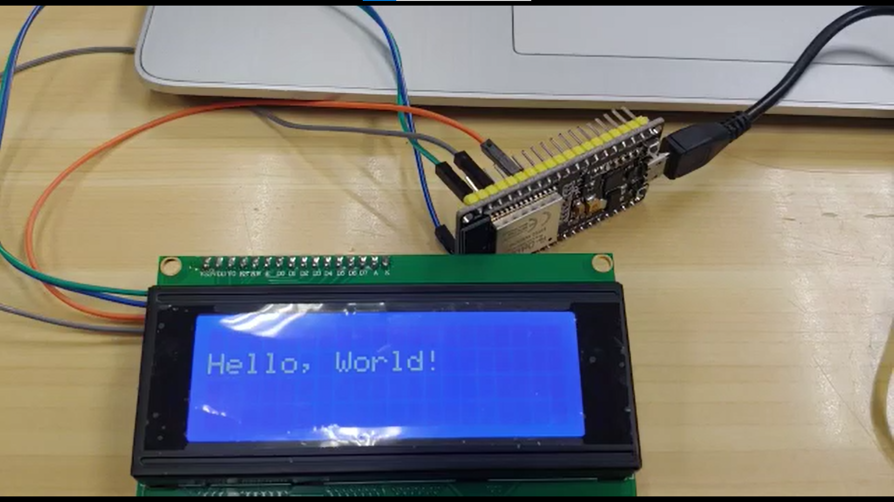
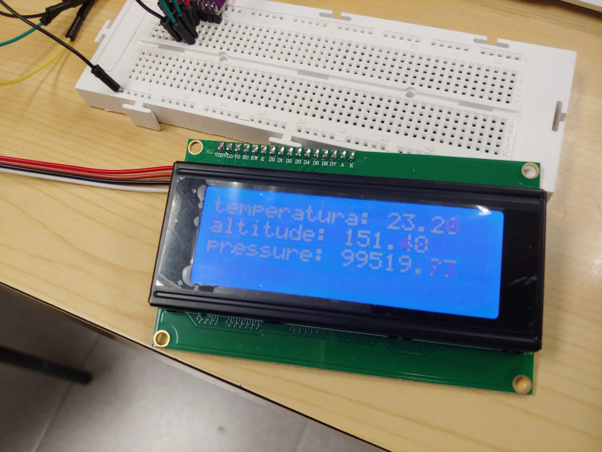

# Pràctica 5 : Busos de comunicació I (introducció i I2C)

## **Objectiu** 
L'objectiu principal de la pràctica és entendre el funcionament dels busos, sistemes de comunicació entre perifèrics.

## **Material**

### Tecnologies Utilitzades
- ESP32-WROOM-32
- Cables
- Placa Protoboard
- Sensor de temperatura, pressió i altitud (BMP280)
- Display I2C LCD
### Software
- Visual studio
- PlatformIO
- Llibreries "LiquidCrystal_I2C" i "Adafruit" de PlatformIO

## **PART 1: DISPLAY I2C LCD**

En aquesta primera part, l'objectiu és connectar la pantalla I2C LCD al microprocessador i fer que es mostri un missatge per aquesta. Això s'aconseguirà mitjantnçant quatre cables famella-famella que uniran els quatre pins del LCD amb els pins corresponents del microprossessador.

## **Codi**
~~~cpp
#include <LiquidCrystal_I2C.h>

// set the LCD number of columns and rows
int lcdColumns = 16;
int lcdRows = 2;

// set LCD address, number of columns and rows
// if you don't know your display address, run an I2C scanner sketch
LiquidCrystal_I2C lcd(0x27, lcdColumns, lcdRows);  

void setup(){
  // initialize LCD
  lcd.init();
  // turn on LCD backlight                      
  lcd.backlight();
}

void loop(){
  // set cursor to first column, first row
  lcd.setCursor(0, 0);
  // print message
  lcd.print("Hello, World!");
  delay(1000);
  // clears the display to print new message
  lcd.clear();
  // set cursor to first column, second row
  lcd.setCursor(0,1);
  lcd.print("I'm, Gerard!");
  delay(1000);
  lcd.clear(); 
}
~~~

## **Explicació i Funcionament del Codi**
Primerament s'ha de descarregar i afegir al projecte la llibreria *LiquidCrystal_I2C*. 

Seguidament es declara el nombre de files i columnes de la pantalla LCD i es passa com a paràmetres a la funció *lcd* de *LiquidCrystal_I2C*.

A continuació s'inicia el LCD amb la funció "init" i s'encén el "backlight" del LCD, és a dir, la pantalla es mostra completament blava sense cap informació impresa sobre aquesta.

Finalment, un bucle (loop) fa que es mostrin dos missatges pel display, utilitzant la funció *print*. Aquests missatges apareixen intermitentment a la part superior i inferior de la pantalla respectivament, per eliminar el missatge anterior per donar pas al següent s'utilitza el *clear*. La posició dels missatges ve donada per la funció *setCursor* i el temps entre missatges pel *delay*.

## **Resultat al Display**

## **PART 2: SENSOR BMP280 + DISPLAY I2C LCD**

En aquesta segona part, es mostrarà la informació adquirida pel sensor BMP280 al display LCD. Per connectar el sensor, el display i el miscroprossessador s'utilitzarà una placa protoboard i varis cables. 

## **Codi**
~~~cpp
#include <LiquidCrystal_I2C.h>
#include <Arduino.h>
#include <Wire.h>
#include <Adafruit_Sensor.h>
#include <Adafruit_BMP280.h>

// set the LCD number of columns and rows
int lcdColumns = 16;
int lcdRows = 2;

LiquidCrystal_I2C lcd(0x27, lcdColumns, lcdRows);

Adafruit_BMP280 bmp;
void setup() {
  Serial.begin(9600);
  Serial.println(F("BMP280 test"));
  if (!bmp.begin()) {
    Serial.println(F("Could not find a valid BMP280 sensor, check wiring!"));
    while (1);
  }
  bmp.setSampling(Adafruit_BMP280::MODE_NORMAL,     /* Modo de operación */
                  Adafruit_BMP280::SAMPLING_X2,     
/* Temp. oversampling */
                  Adafruit_BMP280::SAMPLING_X16,    
/* Presion oversampling */
                  Adafruit_BMP280::FILTER_X16,      
/* Filtrado. */
                  Adafruit_BMP280::STANDBY_MS_500); 
/* Tiempo Standby. */

// initialize LCD
  lcd.init();
  // turn on LCD backlight                      
  lcd.backlight();
}
void loop() 
{
    Serial.print(F("Temperatura = "));
    Serial.print(bmp.readTemperature());
    Serial.println(" *C");
    Serial.print(F("Presión = "));
    Serial.print(bmp.readPressure());
    Serial.println(" Pa");
    Serial.print(F("Altitud = "));
    Serial.print(bmp.readAltitude(1013.25));
    Serial.println(" m");
    Serial.println();
    delay(10000);

    // set cursor to first column, first row
  lcd.setCursor(0, 0);
  // print message
  lcd.print("Temperatura = ");
  lcd.print(bmp.readTemperature());
  lcd.println(" *C");
  
  // set cursor to first column, second row
  lcd.setCursor(0,2);
  lcd.print("Altitud = ");
  lcd.print(bmp.readAltitude(1013.25));
  lcd.print(" m");

  lcd.setCursor(0, 4);
  lcd.print("Pression = ");
  lcd.print(bmp.readPressure());
  lcd.println(" *Pa");
}
~~~

## **Explicació i Funcionament del Codi**
S'explicarà només el codi que no apareix a la part 1 d'aquesta pràctica.

En aquesta segona part s'ha de descarregar la llibreria *Adafruit* i afegir les llibreries següents: *LiquidCrystal_I2C.h*,
*Arduino.h*, *Wire.h*, *Adafruit_Sensor.h* i *Adafruit_BMP280.h*.

Primer es declara el *bmp* utilitzant la classe *Adafruit_BMP280* i es comprova si es troba un sensor BPM vàlid. Si no es troba es mostra un missatge d'error pel "terminal".

A continuació s'obra un bucle (loop) on es mostra pel "terminal" els valors de temperatura, pressió i altitud. Aquests valors s'extreuen amb les funcions *readTemperature()*, *readPressure()* i *readAltitude(1013.25)*.

Finalment, dins del "loop" anterior, es fa mostrar els resultats al dysplay *LCD* amb la funció *lcd.print* esmentada a la part 1.

## **Resultat al Display**
