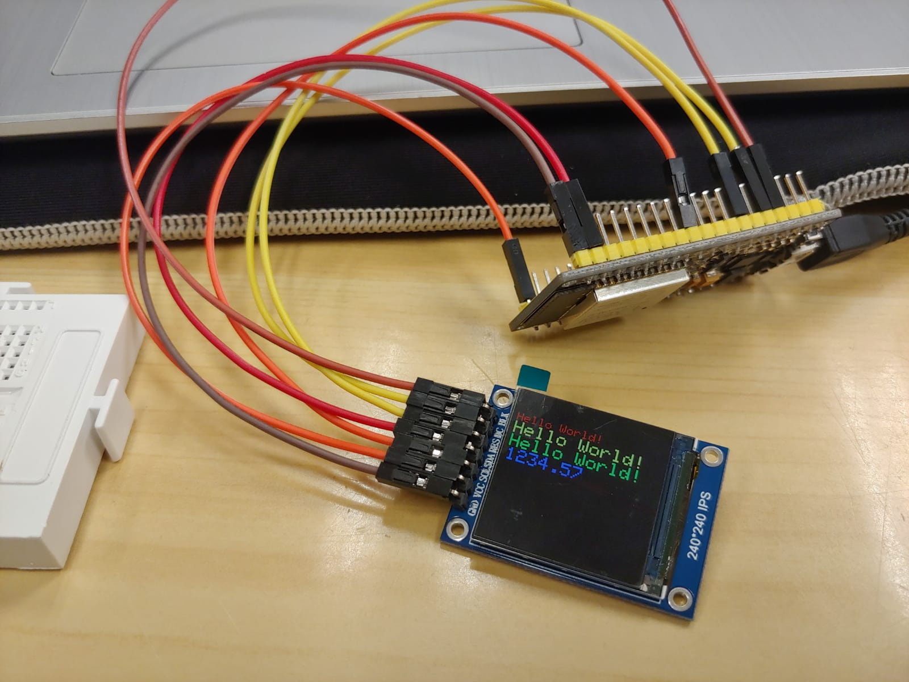
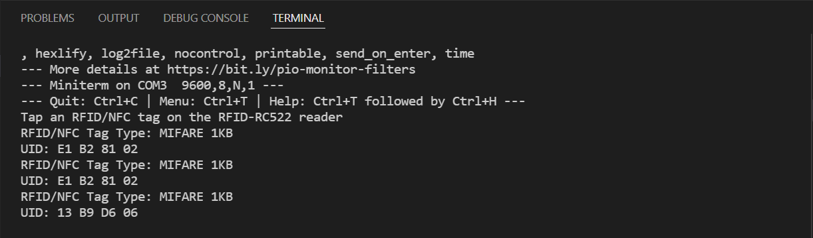

# Pràctica 6 : Busos de comunicació II (SPI)

## **Objectiu** 
L'objectiu principal de la pràctica és entendre el funcionament del bus SPI. 
Per aconseguir-ho utilitzarem un mòdul de lectura RFID, que té instal·lat el SPI, i farem que es mostri la informació per una pantalla.

La pràctica es separarà en tres parts, una centrada exclusivament en la pantalla, una altra en el sensor RFID, i la darrera combinarà les dues parts anteriors.

## **Material**

### Tecnologies Utilitzades
- ESP32-WROOM-32
- Sensor RFID
- Display SPI (pantalla)
- Cables femella-famella
- Placa Protoboard
### Software
- Visual studio
- PlatformIO

## **PART 1: Display SPI (Pantalla)**

## **Codi**
~~~cpp
#include <Arduino.h>
#include <Adafruit_GFX.h>    // Core graphics library
#include <Adafruit_I2CDevice.h>
#include <Adafruit_ST7789.h> // Hardware-specific library for ST7789
#include <SPI.h>             // Arduino SPI library

#define TFT_MOSI 23  // SDA Pin on ESP32
#define TFT_SCLK 18  // SCL Pin on ESP32
#define TFT_CS   15  // Chip select control pin
#define TFT_DC    2  // Data Command control pin
#define TFT_RST   4  // Reset pin (could connect to RST pin)

// Initialize Adafruit ST7789 TFT library
Adafruit_ST7789 tft = Adafruit_ST7789(TFT_CS, TFT_DC, TFT_RST);
 
float p = 3.1415926;
 
void tftPrintTest() {
  tft.setTextWrap(false);
  tft.fillScreen(ST77XX_BLACK);
  tft.setCursor(0, 30);
  tft.setTextColor(ST77XX_RED);
  tft.setTextSize(2);
  tft.println("Hello World!");
  tft.setTextColor(ST77XX_YELLOW);
  tft.setTextSize(3);
  tft.println("Hello World!");
  tft.setTextColor(ST77XX_GREEN);
  tft.setTextSize(3);
  tft.println("Hello World!");
  tft.setTextColor(ST77XX_BLUE);
  tft.setTextSize(3);
  tft.print(1234.567);
  delay(1500);
  tft.setCursor(0, 0);
  tft.fillScreen(ST77XX_BLACK);
  tft.setTextColor(ST77XX_WHITE);
  tft.setTextSize(0);
  tft.println("Hello World!");
  tft.setTextSize(1);
  tft.setTextColor(ST77XX_GREEN);
  tft.print(p, 6);
  tft.println(" Want pi?");
  tft.println(" ");
  tft.print(8675309, HEX); // print 8,675,309 out in HEX!
  tft.println(" Print HEX!");
  tft.println(" ");
  tft.setTextColor(ST77XX_WHITE);
  tft.println("Sketch has been");
  tft.println("running for: ");
  tft.setTextColor(ST77XX_MAGENTA);
  tft.print(millis() / 1000);
  tft.setTextColor(ST77XX_WHITE);
  tft.print(" seconds.");
}
 
void setup(void) {
  Serial.begin(115200);
    
  tft.init(240, 240, SPI_MODE2);    // Init ST7789 display 135x240 pixel
  tft.setRotation(3);
  tft.fillScreen(ST77XX_BLACK);
}
 
void loop() {
  tft.invertDisplay(true);
  tftPrintTest();
  delay(1000);
  tft.invertDisplay(false);
  tftPrintTest();
  delay(1000);
}
~~~

## **Explicació i Funcionament del Codi**
Primerament s'inclou la llibreria "Adafruit ST7789", es defineixen els pins i s'inicialitzen.

A continuació, dins del void(), amb les funcions "fillScreen()", "setCursor()", "setTextColor()", "setTextSize()" i "println()", es fa mostrar pel display un missatge amb un tamany, color del fons i de la lletra determinats.

Seguidament, dins del setup, s'inicialitza el tamany, en píxels, del display. En aquest cas 240x240 píxels.

Finalment s'obra un "loop()", que farà s'executi la funció "void()" anterior.

*Resultat al display:*

## **PART 2: Sensor RFID**

## **Codi**
~~~cpp
#include <SPI.h>
#include <MFRC522.h>

#define SS_PIN  5  // ESP32 pin GIOP5 
#define RST_PIN 27 // ESP32 pin GIOP27 

MFRC522 rfid(SS_PIN, RST_PIN);

void setup() {
  Serial.begin(9600);
  SPI.begin(); // init SPI bus
  rfid.PCD_Init(); // init MFRC522

  Serial.println("Tap an RFID/NFC tag on the RFID-RC522 reader");
}

void loop() {
  if (rfid.PICC_IsNewCardPresent()) { // new tag is available
    if (rfid.PICC_ReadCardSerial()) { // NUID has been readed
      MFRC522::PICC_Type piccType = rfid.PICC_GetType(rfid.uid.sak);
      Serial.print("RFID/NFC Tag Type: ");
      Serial.println(rfid.PICC_GetTypeName(piccType));

      // print UID in Serial Monitor in the hex format
      Serial.print("UID:");
      for (int i = 0; i < rfid.uid.size; i++) {
        Serial.print(rfid.uid.uidByte[i] < 0x10 ? " 0" : " ");
        Serial.print(rfid.uid.uidByte[i], HEX);
      }
      Serial.println();

      rfid.PICC_HaltA(); // halt PICC
      rfid.PCD_StopCrypto1(); // stop encryption on PCD
    }
  }
}
~~~

## **Explicació i Funcionament del Codi**
Primerament s'inclouen les llibreries "SPI.h" i "MFRC522.h", es defineixen els pins i s'inicialitzen.

A continuació, dins del setup, sinicilitza el bus i es mostra pel "terminal" un missatge conforme ja es pot passar el RFID o el NFC per sobre del lector.

Finalment s'obra un "loop()" que llegeix el RFID, guarda el nom d'aquest i el mostra pel "terminal", mitjançant les funcions "PICC_ReadCardSerial()" i "PICC_GetType()".

Com es pot observar a la imatge següent, obtenim el ID de la targeta RFID. Si posem la mateixa targeta tornem a obtenir el mateix ID, en canvi si en llegim una de diferent el ID canvia.

*Resultat al terminal:*

## **PART 3: Sensor i Display**

## **Codi**
~~~cpp
#include <Arduino.h>
#include <Adafruit_GFX.h>    // Core graphics library
#include <Adafruit_I2CDevice.h>
#include <Adafruit_ST7789.h> // Hardware-specific library for ST7789
#include <SPI.h>             // Arduino SPI library
#include <MFRC522.h>

#define SS_PIN  5  // ESP32 pin GIOP5 
#define RST_PIN 27 // ESP32 pin GIOP27 
MFRC522 rfid(SS_PIN, RST_PIN);

#define TFT_MOSI 23  // SDA Pin on ESP32
#define TFT_SCLK 18  // SCL Pin on ESP32
#define TFT_CS   15  // Chip select control pin
#define TFT_DC    2  // Data Command control pin
#define TFT_RST   4  // Reset pin (could connect to RST pin)

// Initialize Adafruit ST7789 TFT library
Adafruit_ST7789 tft = Adafruit_ST7789(TFT_CS, TFT_DC, TFT_RST);
 

 void setup(void) {
  Serial.begin(9600);
    
  tft.init(240, 240, SPI_MODE2);    // Init ST7789 display 135x240 pixel
  tft.setRotation(3);
  tft.fillScreen(ST77XX_BLACK);

  Serial.begin(9600);
  SPI.begin(); // init SPI bus
  rfid.PCD_Init(); // init MFRC522
  Serial.println("Tap an RFID/NFC tag on the RFID-RC522 reader");
}

void loop() {
  if (rfid.PICC_IsNewCardPresent()) { // new tag is available
    if (rfid.PICC_ReadCardSerial()) { // NUID has been readed
      MFRC522::PICC_Type piccType = rfid.PICC_GetType(rfid.uid.sak);
      
      Serial.print("RFID/NFC Tag Type: ");
      tft.fillScreen(ST77XX_BLACK);
      tft.setCursor(0, 30);
      tft.setTextColor(ST77XX_RED);
      tft.setTextSize(2);
      tft.print("RFID/NFC Tag Type: ");
      Serial.println(rfid.PICC_GetTypeName(piccType));
      tft.print(rfid.PICC_GetTypeName(piccType));
      // print UID in Serial Monitor in the hex format
      Serial.print("UID:");
      tft.print("UID:");
      for (int i = 0; i < rfid.uid.size; i++) {
        Serial.print(rfid.uid.uidByte[i] < 0x10 ? " 0" : " ");
        tft.print(rfid.uid.uidByte[i] < 0x10 ? " 0" : " ");
        Serial.print(rfid.uid.uidByte[i], HEX);
        tft.print(rfid.uid.uidByte[i], HEX);
      }
      Serial.println();
      
      rfid.PICC_HaltA(); // halt PICC
      rfid.PCD_StopCrypto1(); // stop encryption on PCD
    }
  }
}
~~~

## **Explicació i Funcionament del Codi**

Aquest codi és la combinació dels dos codis de les parts anteriors. Per tant s'inclouen les llibreries de la part 1 i 2, i es defineixen els pins. 

S'utilitzen les mateixes funcions comentades a les parts anteriors, i es fa la unió dels codis fent que, en comptes de que el display mostri un missatge escrit per nosaltres, mostri la informació del sensor RFID. És a dir, la informació que obteniem pel "terminal" a la part 2, ara apareixerà impresa al display.

